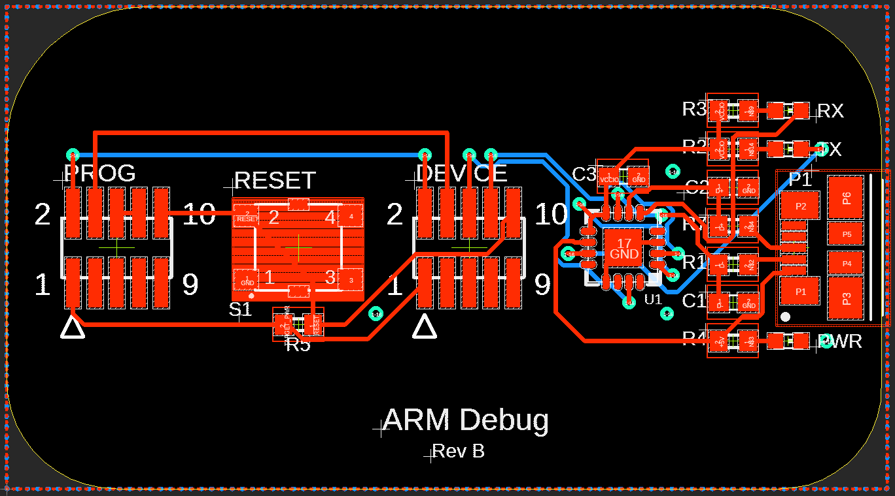

# ARM Debug Board

This debug board allows two unused traces of a 10pin JTAG/SWD connector to be broken out and used for a UART RX & TX line from the target PCB. In this case, the UART lines are used for sending out Debug data from the target MCU. This is useful since board space is no longer needed on the target PCB for any sort of headers or test pads connected to the UART RX & TX.

In RevB a UART to USB bridge was added to the board (FT230XQ-T) to remove the need for a special FTDI cable, and instead a standard Mico USB cable can be used to connect the board to a PC.

## Components
- [10pin JTAG/SWD Header - **ftsh-105-01-l-dv-k**](https://www.samtec.com/partnumber/ftsh-105-01-l-dv-k-tr?vendor=digikey)

