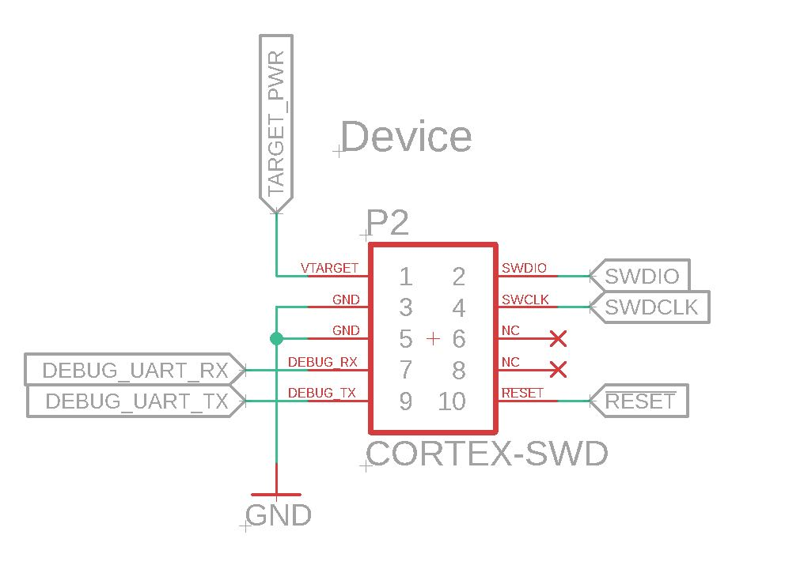
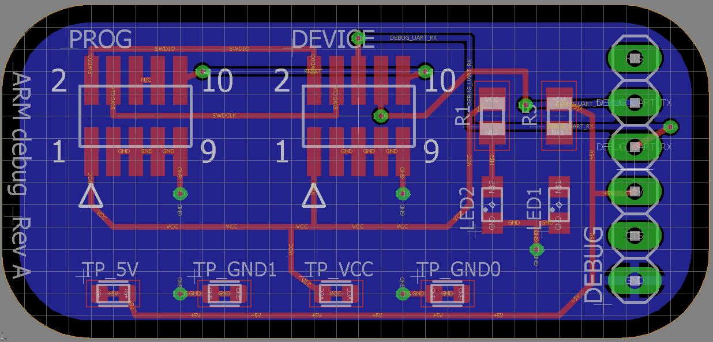

# ARM Debug Board
This debug board allows two unused traces of a 10pin JTAG/SWD connector to be broken out and used for a UART RX & TX line from the target PCB. In this case, the UART lines are used for sending out Debug data from the target MCU. This is useful since board space is no longer needed on the target PCB for any sort of headers or test pads connected to the UART RX & TX. 

This current design is intended to be used with an [FTDI TTL-232R-3V3](http://www.ftdichip.com/Products/Cables/USBTTLSerial.htm) cable. The design also has four TE Test points used for probing the 5V, 3.3V, and GND signals from the target device and FTDI cable and/or providing power to the target.

##### Components
- 10pin JTAG/SWD Header - **ftsh-105-01-l-dv-k**
- TE Test Points - **RCU-0C / 1625854-3**

