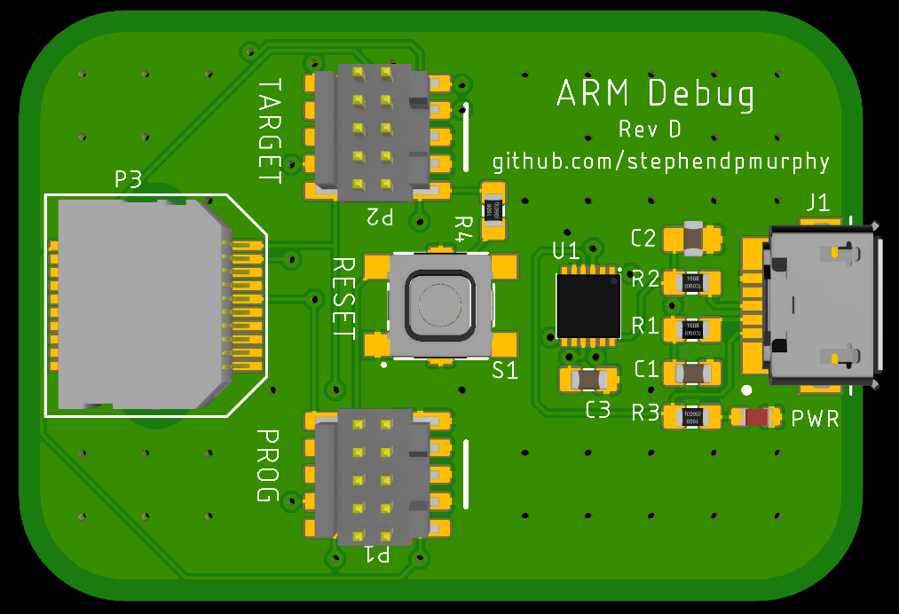

# ARM Debug Board

This debug board allows two unused traces of a 10pin JTAG/SWD connector (Pins 7 & 9) to be broken out and used for a UART RX & TX line from the target MCU. These UART lines can be used by the Target to send debug print statements through the programming connector, to the USB bridge, and then displayed on a PC terminal. This is useful since board space is no longer needed on the target for any sort of extra headers or test pads for debug data.

All components are included via a managed library on my account. Create an issue on this repo to request access.

Note: This can only be used with Targets that use SWD as the programming interface. A different board will need to be made in the case the pinout changes of the Samtech Cortex header (TPI, SPI, etc.)

